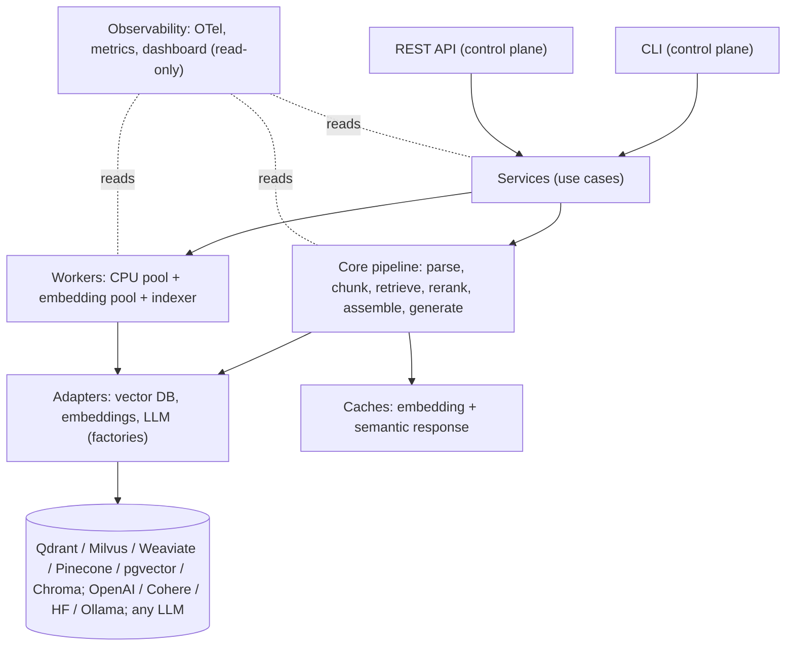

# architecture.md — Component Architecture

How fasterRag achieves its speed, quality, and pluggability goals. Flows in [flow.md](flow.md); layout in [structure.md](structure.md); every parameter in [config-reference.md](config-reference.md).

## 1. Component overview



The dashboard and all observability components are strictly read-only consumers of pipeline events — nothing in the pipeline depends on them, and they expose no control endpoints.

## 2. Multi-worker parallelism

The ingestion pipeline is **decoupled** into two pools connected by a bounded queue:

- **CPU worker pool** — loading, parsing, and chunking are CPU-bound; N processes (default: CPU count) consume the ingest queue.
- **GPU/embedding worker pool** — embedding generation is accelerator/provider-bound; M workers consume the chunk queue.

Design rules:

- **Streaming hand-off.** Chunks stream from the CPU pool to the embedding pool as they are produced, so expensive embedding workers never idle waiting on parsing.
- **Stateful embedding workers.** Each embedding worker loads the embedding model into memory **once per worker** and reuses it across all batches. Reloading a model per task is a large avoidable cost — a local model takes seconds to load against milliseconds of retrieval — and is prohibited by design. The size of that gap on reference hardware is unmeasured (TASK-0084).
- **Fault tolerance from decoupling.** Because stages communicate only via queues, a failed embedding job is retried from the queue without re-parsing its document; a crashed CPU worker loses only its in-flight item. Each stage checkpoints progress in the job record.
- **Backpressure.** The chunk queue is bounded (`workers.queue_depth`). If embedding lags, CPU workers block on enqueue rather than filling memory; if a remote embedding provider throttles, the queue absorbs the burst instead of hammering the rate limit.

## 3. Batching

- **Embedding**: per-document batched embedding amortizes per-request overhead that one-at-a-time calls pay per text — requests are aggregated to `embeddings.batch_size` texts. The saving is unmeasured (TASK-0084). Async batch embedding with queued workers prevents pipeline stalls and provider rate-limit throttling.
- **LLM inference**: provider calls are batched where the provider supports it; concurrent generation requests share connection pools.
- **Indexing**: vector upserts go to the adapter in batches, amortizing network round-trips.

## 4. Async FastAPI

- All I/O-bound endpoints are `async`. The API process performs no CPU-heavy work.
- **Queue-based decoupling of ingestion**: `POST /v1/ingest` validates, persists a job record, enqueues, and returns `202 Accepted` with a `job_id` — the API accepts ingestion asynchronously without blocking on parsing/embedding/indexing.
- Generation responses stream (SSE) so time-to-first-token is decoupled from total generation time.

## 5. Configurable chunking pipeline

Selected via `chunking.strategy` (see [config-reference.md](config-reference.md)):

| Strategy | Description |
|---|---|
| `fixed` | Fixed-size token windows with overlap. Baseline; requires no model inference. |
| `recursive` | Recursive/hierarchical splitting on structural separators (sections → paragraphs → sentences) down to target size. |
| `semantic` | Split at semantic-similarity boundaries between adjacent sentences/passages. |
| `layout` | Layout/document-structure-aware: respects headings, tables, lists, and reading order from the parser. |
| `late` | Late chunking: embed the whole document first, then derive each chunk's embedding by pooling the token representations inside its span. Boundaries are identical to `recursive`; only the vectors change, so a chunk saying "It was raised from 35 pounds" carries what "it" refers to instead of losing it at the boundary. Needs token-level output, which only a **local** embedding model exposes — on a hosted provider the pipeline logs the reason and falls back to ordinary per-chunk embedding, making the strategy no better than `recursive` rather than broken. Documents longer than the model's context are processed in overlapping windows, each token taking its representation from the window that gave it the most surrounding context; the strategy is most valuable with a long-context embedding model where a document fits in one pass. |
| contextual enrichment (`chunking.contextual_enrichment`, composable with any strategy) | Contextual-retrieval-style enrichment: prepend a short document-level context to each chunk **before** embedding and BM25 indexing. |

**Sizing guidance.** A practical working range of **~512–1024 tokens** serves most retrieval workloads. There is a documented **"context cliff" around ~2,500 tokens**, beyond which retrieval quality degrades — treat this as a directional ceiling rather than a hard constant; it comes from a single January 2026 preprint.

**Contextual Retrieval evidence.** Per Anthropic's September 2024 engineering post *"Contextual Retrieval in AI Systems"*, Contextual Embeddings + Contextual BM25 **reduce failed retrievals by 49%**, and **by 67% when combined with reranking** — cutting the top-20-chunk retrieval failure rate from **5.7% to 1.9%**. Quote: *"This method can reduce the number of failed retrievals by 49% and, when combined with reranking, by 67%."* fasterRag's implementation follows the post's cost guidance: keep generated per-chunk context short (**~50–100 tokens**, `chunking.context_tokens`) and use **prompt caching of the parent document** so the context-generation LLM re-reads the document from cache rather than re-billing full input tokens per chunk.

## 6. Hybrid search + reranking

The retrieval stack, in order:

1. **Dense leg** — ANN search over the vector index, top `retrieval.rerank_top_n` candidates.
2. **Sparse leg** — **BM25** keyword search over the same corpus, same candidate count. Both legs run in parallel and receive pushed-down metadata filters.
3. **Fusion** — **Reciprocal Rank Fusion with k=60**, the value recommended in the original 2009 SIGIR paper by Gordon V. Cormack, Charles L. A. Clarke, and Stefan Büttcher, *"Reciprocal Rank Fusion outperforms Condorcet and individual Rank Learning Methods,"* shown robust across TREC/LETOR benchmarks. `RRF(d) = Σ 1/(k + rank_i(d))`.
4. **Reranking** — a **cross-encoder reranker** scores the fused top candidates (retrieve top 100–1000 → rerank → truncate to `top_k`).

Design rationale (**not measurements** — no ledger entry isolates either stage, so neither statement may be quoted as a number or a ranking; see [benchmarks.md](benchmarks.md) and TASK-0084):

- Reranking adds latency to every query, growing with `retrieval.rerank_top_n` and the size of the cross-encoder. **fasterRag has never measured the stage**, and the "~100–300 ms" figure earlier revisions of this document quoted had no source; it has been withdrawn rather than re-stated. Measure it on your own hardware with `fasterrag benchmark`.
- Reranking and the sparse leg are the two levers this stack expects to matter most for retrieval quality, because dense search misses exact identifiers and rare terms that BM25 catches, and a cross-encoder sees the query and the passage together where a bi-encoder cannot. That is the reasoning behind the defaults, not a measured ranking of upgrades.

## 7. Caching

| Cache | Keyed by | Notes |
|---|---|---|
| **Embedding cache** | content hash of text + model + version | Skips re-embedding identical chunks/queries; enabled by default. |
| **Semantic response cache** | embedding similarity of the query (cosine threshold, typically **~0.92–0.97**) | A sufficiently similar previous query returns its cached answer without touching the pipeline. |
| **Provider prompt caching** | provider-side | Used for contextual-enrichment (parent doc) and long shared prompts. |

Invalidation is **TTL + event-driven**: entries expire after `cache.ttl`, and corpus changes (ingest, delete, re-index) invalidate affected entries immediately — stale answers must never outlive the data they came from. **Cache hit/miss counters are first-class metrics** exposed to the dashboard and Grafana.

## 8. Streaming responses

Generation streams token-by-token over SSE. Time-to-first-token matters more than total latency for perceived speed; context assembly and generation are pipelined so the first token is emitted as soon as the provider produces it.

## 9. Incremental updates

- **Deduplication** — content hashes computed at ingestion; identical documents/chunks are skipped or version-bumped, never duplicated.
- **Versioned metadata** — every chunk records source URI, document version, ingestion timestamp, parser flags, embedding model + version.
- **Re-embedding** — when the configured embedding model differs from the indexed one, the system flags drift and offers a guided `index reembed` (build a parallel collection, then atomically swap) to fight embedding drift and stale indexes.

## 10. Pluggability: adapter + factory patterns

### VectorDBAdapter

Abstract base interface with the standard methods:

```python
class VectorDBAdapter(ABC):
    """Vendor-neutral vector database contract."""

    async def create_collection(self, spec: CollectionSpec) -> None: ...
    async def upsert(self, points: list[Point]) -> UpsertResult: ...
    async def search(self, query: SearchQuery) -> list[ScoredPoint]: ...
    async def update(self, updates: list[PointUpdate]) -> None: ...
    async def delete(self, selector: PointSelector) -> None: ...
    async def health(self) -> HealthStatus: ...
```

Each request type additionally carries an optional **sparse vector**, because the BM25 leg lives inside the collection rather than in a separate index ([ADR-0007](adr/ADR-0007-bm25-as-backend-sparse-vectors.md)): `CollectionSpec.sparse` creates the keyword index, `Point.sparse` writes term frequencies alongside the dense vector, and `SearchQuery.sparse` runs the keyword leg. A `SearchQuery` carries exactly one leg — hybrid retrieval runs both and fuses the rankings in fasterRag, so `retrieval.rrf_k` is the constant that actually applies rather than whatever a backend's built-in fusion hard-codes.

A **factory** reads `vector_db.provider` and instantiates the concrete adapter. **Qdrant is the reference implementation**, and **pgvector** ships alongside it — a second, deliberately opposite (SQL) paradigm passing the same contract suite, which is what makes the vendor-neutral contract evidence rather than intent. **Milvus, Weaviate, Pinecone, and Chroma are specified but not built** (TASK-0049); the factory refuses them by name at config load rather than accepting the setting and failing later. A single `vector_db.provider` change swaps between the shipped backends with **no application-code changes**. Rationale in [ADR-0001](adr/ADR-0001-qdrant-as-reference-vector-db.md) and [ADR-0002](adr/ADR-0002-adapter-factory-pluggability.md).

### Qdrant specifics

- **Modes**: (a) **system-managed Docker** — fasterRag launches and manages the container; (b) **no-Docker** — the user runs Qdrant themselves and fasterRag connects to it; (c) **remote** — connection via `host:port`/IP when Qdrant runs on another machine.
- **Ports/protocols**: per Qdrant's official Python client docs, `QdrantClient` defaults are `port=6333` (REST) and `grpc_port=6334` (gRPC); `prefer_grpc` defaults to `False`. **Both 6333 and 6334 must be exposed** — Qdrant GitHub Discussion #2195 records connection failures when only 6333 is exposed and the client attempts gRPC.
- **Persistence**: mount a storage volume. On **Windows/WSL use a named Docker volume** — bind mounts have known file-system data-loss issues per Qdrant's install docs.
- **Security**: authenticated access via `QDRANT__SERVICE__API_KEY`; the key itself lives in `.env`, referenced from config by env-var name.

### Embedding and LLM factories

Same pattern: `embeddings.provider` and `llm.provider` select concrete adapters (OpenAI, Cohere, HuggingFace/sentence-transformers, Ollama/local for embeddings; any LLM provider). **Tiered embedding** routes document classes to different models — cheap models for high-volume/low-priority classes, higher-cost models where retrieval precision matters.

### Config-driven dynamism

- `config.yaml` drives ALL behavior; `.env` holds ONLY soft credentials/secrets ([ADR-0003](adr/ADR-0003-config-yaml-env-split.md)).
- Loader: **pydantic-settings** with a YAML source for config and env/`.env` for secrets. Validation runs at startup and **fails fast** with a clear error naming the offending key. This decouples application logic from the config source and enforces 12-factor separation of config and credentials.
- **Every integration option defaults to `false`.** Flipping e.g. `langfuse: true` causes the system to read config, **auto-install**, perform **all required configuration** on the user's system, and return a **running URL** — with the strict rule that **no code changes are made at that moment** (pure config-driven provisioning). The provisioning path is idempotent and converges to the desired state, reusing cached images rather than re-pulling them. The same pattern applies to `grafana` and similar tools. Details in [observability.md](observability.md).

## 11. Scaling patterns

- **Vertical**: raise `workers.cpu_pool_size` / `workers.embedding_pool_size` to saturate cores/GPUs; bounded queues keep memory flat.
- **Horizontal (beta)**: multiple worker processes can attach to the same queue backend; the API tier scales as stateless replicas behind a load balancer.
- **Vector DB**: sharding/replication configured per collection through the adapter (`collection.shard_number`, `collection.replication_factor` for Qdrant); remote mode moves the DB to dedicated hardware.
- **Streaming ingestion**: no stage ever materializes an entire corpus in memory — documents flow through queues in bounded batches, which is what makes very large datasets feasible.

## 12. Fault tolerance

- Stage decoupling (Section 2): failures retry at the failing stage only.
- Bounded retries with exponential backoff per queue item; poisoned items park in a dead-letter state on the job record for inspection.
- Idempotent indexing: upserts keyed by deterministic chunk IDs, so replays never duplicate.
- Health/readiness endpoints (`/healthz`, `/readyz`) gate traffic; adapters implement `health()` so a sick backend is visible before queries fail.
- Fail-fast config validation prevents a misconfigured process from ever serving.

## 13. Pain-point coverage

Every pain point in the [scope.md](scope.md) catalogue maps to a mechanism in this document: chunking quality (§5), retrieval accuracy (§6), grounding/citations (§6, §9 metadata), stale indexes and incremental updates (§9), messy PDFs (parser stage, §2), metadata filtering (§6 push-down), hybrid + reranking (§6), evaluation ([testing-strategy.md](testing-strategy.md)), cost (§3, §7), latency (§4, §7, §8), very large datasets (§2, §11), multi-tenancy and security ([security.md](security.md)), observability (§1, [observability.md](observability.md)), vendor lock-in (§10), context-window management (§5 sizing + context assembly budgeter), embedding drift (§9), cold-start (§10 provisioning), retrieval-vs-generation debugging (per-stage traces, [observability.md](observability.md)).
