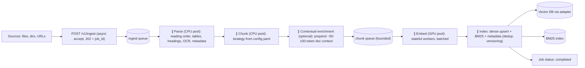
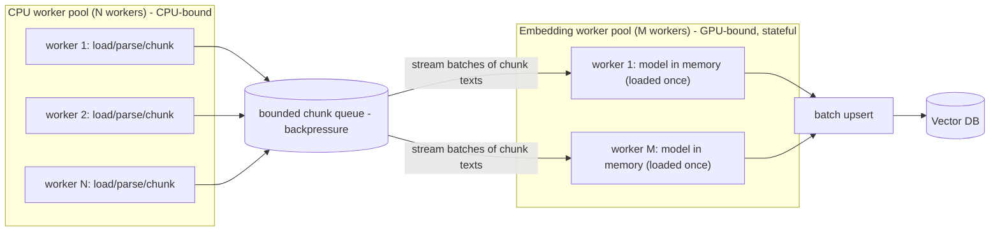
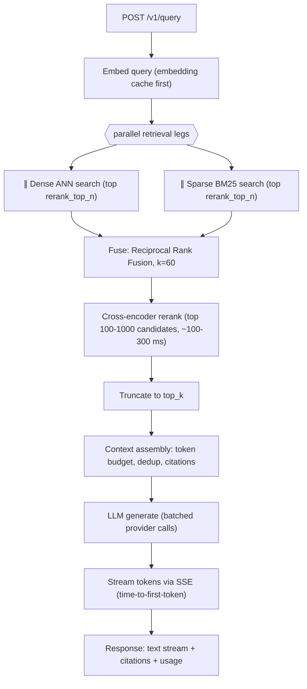
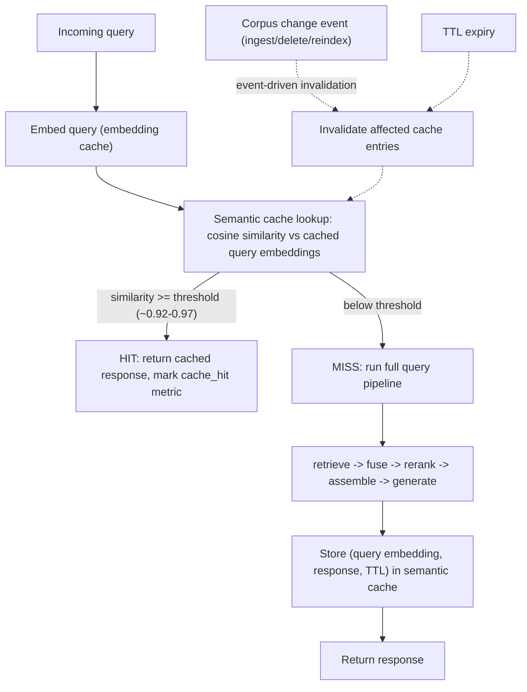
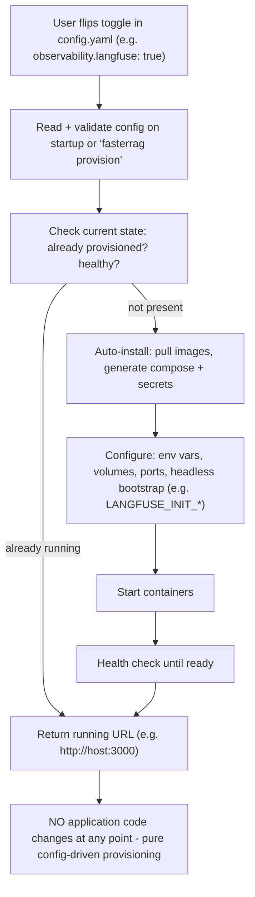

# flow.md — End-to-End Flows

All flows are documented intentions for the beta build. Stages marked **∥** are executed by parallel workers.

## 1. Ingestion flow (source → parse → chunk → embed → index)

Stage sequence: accept → enqueue → parse **∥** → chunk **∥** → enrich **∥** → embed **∥** → index **∥** → report. The API returns immediately after enqueue; all heavy stages run in worker pools.

## 2. Chunking/embedding/indexing worker hand-off (CPU pool → GPU pool streaming)

Key properties:

- **Streaming hand-off**: chunks flow to embedding workers as soon as they exist — expensive embedding workers never idle waiting for parsing to finish.
- **Stateful workers**: each embedding worker loads the model into memory once and reuses it across all batches (no reloading).
- **Fault isolation**: a failed embedding batch is retried from the queue; it never forces re-parsing (decoupled stages = fault tolerance).
- **Backpressure**: the bounded queue (`workers.queue_depth`) throttles CPU workers if embedding falls behind, preventing memory blow-up and provider rate-limit storms.

## 3. Query flow (query → hybrid retrieve → fuse → rerank → assemble → generate → stream)

Metadata filters (if provided) are pushed down into both retrieval legs before fusion.

## 4. Cache flow (semantic cache lookup → hit/miss → pipeline)

Both hit and miss increment the cache hit/miss metrics exposed to the dashboard and Grafana.

## 5. Auto-provisioning flow (config toggle → running URL, no code changes)

The same flow applies to `grafana: true` (provisioning-as-code datasources/dashboards) and `vector_db.mode: docker` (system-managed Qdrant). Provisioning is idempotent and highly optimized: repeated runs converge to the desired state without reinstalling.

## Where parallel workers act (summary)

| Stage | Executor | Parallelism |
|---|---|---|
| Ingestion accept | FastAPI (async) | Concurrent requests, non-blocking |
| Parse / chunk / enrich | CPU worker pool | `workers.cpu_pool_size` processes |
| Embedding | GPU/embedding pool | `workers.embedding_pool_size` stateful workers × batches |
| Indexing | Indexer workers | Batch upserts, concurrent per collection |
| Retrieval legs | Query service | Dense + BM25 run concurrently per query |
| Generation | LLM adapter | Batched calls; streamed output |
